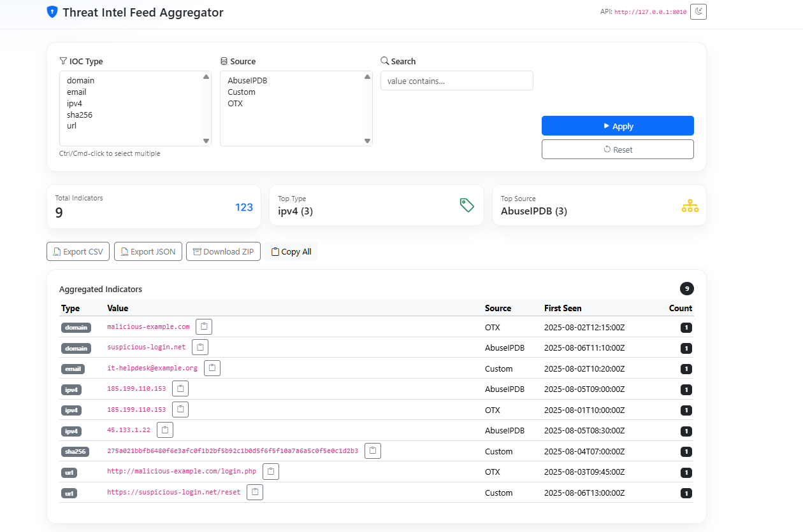

🛡 Threat Intel Feed Aggregator
I built this project to make it easier to centralize, view, and export threat intelligence feeds from multiple sources in one place. Instead of checking AbuseIPDB, AlienVault OTX, or custom feeds individually, this tool pulls them together into a single dashboard so I can quickly assess threats and export them for reporting or further analysis.

🚀 Features
Multiple feed integration – Includes example connectors for:

AbuseIPDB

AlienVault OTX

Custom JSON feed support

Live dashboard view – Quickly see the latest IOCs from all feeds.

Filter & search – Narrow results by feed source, IOC type, or keyword.

Export options – Save filtered data to CSV or JSON for use in other tools.

Lightweight & fast – Runs locally with Python & vanilla JavaScript.

📸 Screenshot example



⚙️ Setup
bash
Copy
Edit
# Clone the repo
git clone https://github.com/igbinore/threat-intel-feed-aggregator.git
cd threat-intel-feed-aggregator

# Create & activate a virtual environment
python -m venv venv
venv\Scripts\activate   # Windows
# source venv/bin/activate  # Mac/Linux

# Install dependencies
pip install -r requirements.txt
▶️ Run
Backend (FastAPI)

bash
Copy
Edit
cd backend
python -m uvicorn app:app --reload --port 8002
Frontend
Open frontend/index.html in your browser.


## 🧱 Project Structure

```text
threat-intel-feed-aggregator/
├─ README.md
├─ requirements.txt
├─ backend/
│  └─ app.py
├─ frontend/
│  └─ index.html
├─ data/
│  ├─ feed_abuseipdb.json
│  ├─ feed_otx.json
│  └─ feed_custom.json
└─ screenshots/
   └─ dashboard_light.png


🛠️ Tech Stack
Backend: FastAPI (Python)

Frontend: Bootstrap 5, Vanilla JS

Data Format: JSON

Export: CSV / JSON

💡 Why I Built This
As a SOC Analyst, I constantly reference multiple threat intel feeds during investigations. Jumping between different sites wastes time, so I built this aggregator to pull everything into one local tool. The idea was to make it:

Fast to run locally

Easy to extend with new feeds

Simple to export & share

📜 License
MIT — free to use and modify.